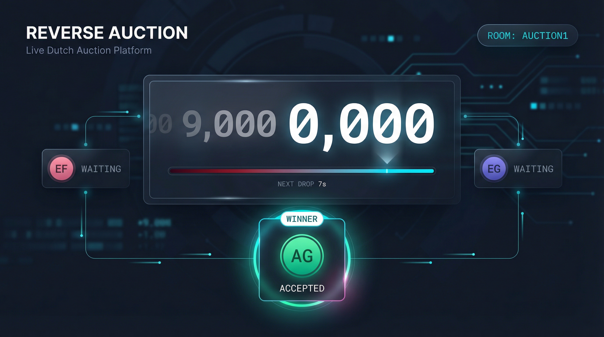

# Reverse Auction (Dutch Auction)



A configurable, real-time reverse auction web app built with React, TypeScript, and Vite.

## Status

✅ **Go for live usage** (latest QA pass found no launch blockers).

See:
- `SECURITY_HARDENING_AUDIT.md`
- `LAUNCH_RUNBOOK.md`

## Overview

This app runs a descending-price (Dutch) auction where participants accept the current price to win.

It supports:
- local single-screen usage
- remote shared rooms across locations
- runtime configuration from the UI
- startup defaults via `public/setup.js`

## Current Remote Architecture

Remote mode is powered by **Supabase Realtime**.

- Room metadata: `rooms`
- Participant claims: `room_participants`
- Room state: `auction_rooms` (includes last event, status, and full state snapshot)
- Event log: `auction_events`
- Room snapshots: full state (price, history, config, participants) persisted for late-joiner sync and authoritative state recovery

## Features

- Descending-price auction flow
- Configurable start price, floor price, decrement amount, and tick interval (seconds or minutes with quick presets: 10s, 30s, 1m, 5m)
- Host-only remote controls (start/reset)
- Participant claim locks (no duplicate slot claims)
- Start gating until all required participants are claimed
- Winner capture at click-time price with bid price-lock protection
- Real-time participant presence (join/leave toasts) and connection status indicators
- Participant readiness visibility (READY/PASSED states)
- Floor-reached / no-deal terminal state with clear UI
- Authoritative room state snapshots (ensures late joiners sync correctly)
- Auction history view
- Sound cues (start, drop, bid, end)
- Setup modal for runtime reconfiguration
- Configurable participant initials (comma-separated)
- In-app toasts for user-facing errors

## Configuration

You can configure auction behavior in two ways.

### 1) Frontend setup panel (GUI)
Use the **Setup** button in the header to adjust:
- start price
- floor price  
- decrement amount
- drop interval (seconds or minutes, with presets: 10s, 30s, 1m, 5m)
- number of participants
- participant initials (comma-separated)

Validation enforces:
- floor price must be less than start price
- decrement amount must not exceed price range (start - floor)
- participant initials count must match participant count
- all numeric values must be positive

### 2) `public/setup.js`
Set startup defaults before the app loads:

```js
window.AUCTION_SETUP = {
  // Supabase public config (safe client-side)
  supabaseUrl: 'https://<project-ref>.supabase.co',
  supabaseAnonKey: 'sb_publishable_...',

  startPrice: 20000,
  floorPrice: 1000,
  decrementAmount: 1000,
  dropIntervalMs: 10000,
  participantCount: 3,
  participants: [
    { id: '1', name: 'EF', color: 'bg-rose-500' },
    { id: '2', name: 'EG', color: 'bg-indigo-500' },
    { id: '3', name: 'AG', color: 'bg-emerald-500' },
  ],
};
```

If `participantCount` is greater than `participants.length`, extra participants are generated automatically.

## Tech Stack

- React 19
- TypeScript
- Vite
- Tailwind CSS (CDN)
- Supabase (Postgres + Realtime + Anonymous Auth)

## Project Structure

```text
.
├── App.tsx
├── constants.ts
├── types.ts
├── components/
│   ├── Ticker.tsx
│   └── FounderButton.tsx
├── services/
│   ├── soundService.ts
│   └── syncService.ts
├── public/
│   ├── setup.js
│   ├── favicon.ico
│   └── favicon.png
├── supabase_phase0.sql
├── SECURITY_HARDENING_AUDIT.md
├── LAUNCH_RUNBOOK.md
└── .github/workflows/
    └── deploy-pages.yml
```

## Local Development

### Prerequisites
- Node.js 18+ (Node 20 recommended)
- npm

### Optional `.env.local`

```bash
VITE_SUPABASE_URL=...
VITE_SUPABASE_ANON_KEY=...
```

`syncService` supports both:
1. `VITE_SUPABASE_*` env vars
2. `window.AUCTION_SETUP.supabaseUrl` + `supabaseAnonKey`

### Run

```bash
npm install
npm run dev
```

### Build

```bash
npm run build
npm run preview
```

## Database Setup (Supabase)

1. Enable **Anonymous Auth**.
2. Run `supabase_phase0.sql` in Supabase SQL Editor.
3. Verify tables are in publication `supabase_realtime`.

## GitHub Pages Deployment

Workflow:
- `.github/workflows/deploy-pages.yml`

Setup:
1. **Settings → Pages** → Source = GitHub Actions
2. **Settings → Secrets and variables → Actions**
   - `VITE_SUPABASE_URL`
   - `VITE_SUPABASE_ANON_KEY`
3. Push to `main`

Site URL:
- `https://<username>.github.io/<repo-name>/`

## Legal Disclaimer

This project and its documentation are for technical and informational purposes only and do **not** constitute legal advice.
Legal enforceability and compliance obligations vary by jurisdiction and use case.
Consult qualified legal counsel before relying on this software for legally binding transactions.

## Contributing

Pull requests and issues are welcome.

## License

Add a license file (`LICENSE`) for your preferred license terms.
